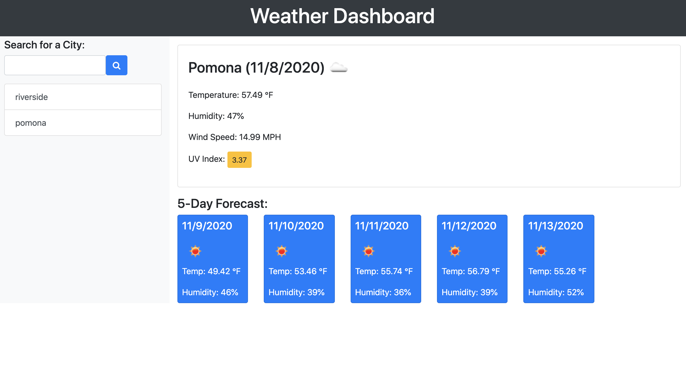

# Weather-Dashboard

A weather dashboard application that allows the user to search for current weather information from any city, as well as obtain a five day forecast. This information is pulled from the Open Weather Map API and generated onto the page. Built with JavaScript, HTML, CSS.

You can access the deployed application here:
[https://hromero7.github.io/weather-dashboard2.0/](https://hromero7.github.io/weather-dashboard2.0/)

## The Challenge

Create a weather dashboard that will run in the browser and feature dynamically updated HTML and CSS. Use the OpenWeather API to retrieve weather data for cities. Use localStorage to store any persistent data.

## The Output

Screenshots of the completed application are below:

**Main Page**



## Installation

Clone the repo:
```
git clone https://github.com/hromero7/weather-dashboard2.0.git
```

The project was uploaded to [GitHub](https://github.com/) at the following repository:
[https://github.com/hromero7/weather-dashboard2.0](https://github.com/hromero7/weather-dashboard2.0)
